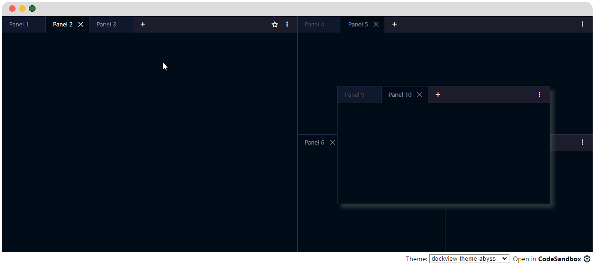

<h1>dockview</h1>

Zero dependency layout manager supporting tabs, groups, grids and splitviews. Supports React, Vue and Vanilla TypeScript

---

##

Please see the website: https://dockview.dev

## Features

-   Serialization / deserialization with full layout management
-   Support for split-views, grid-views and 'dockable' views
-   Themeable and customizable
-   Tab and Group docking / Drag n' Drop
-   Popout Windows
-   Floating Groups
-   Extensive API
-   Supports Shadow DOMs
-   High test coverage
-   Documentation website with live examples
-   Transparent builds and Code Analysis
-   Security at mind - verifed publishing and builds through GitHub Actions

Want to verify our builds? Go [here](https://www.npmjs.com/package/dockview#Provenance).
