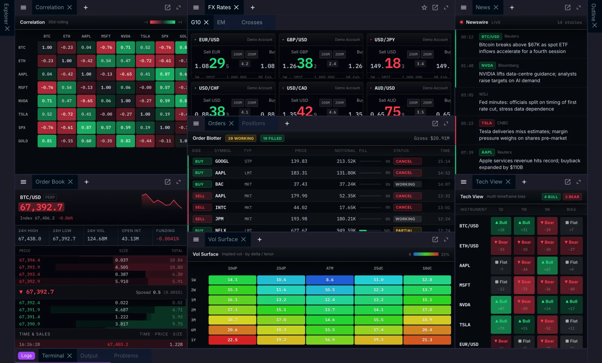

<div align="center">

<picture>
  <source media="(prefers-color-scheme: dark)" srcset="packages/docs/static/img/dockview-lockup-dark.svg">
  
</picture>

<h1>docking engine for the web</h1>

<p>Zero dependency layout manager supporting tabs, groups, grids and splitviews. Supports React, Vue, Angular and JavaScript</p>

[](https://www.npmjs.com/package/dockview)
[](https://www.npmjs.com/package/dockview)
[](https://github.com/mathuo/dockview/actions?query=workflow%3ACI)
[](https://sonarcloud.io/summary/overall?id=mathuo_dockview)
[](https://sonarcloud.io/summary/overall?id=mathuo_dockview)
[](https://bundlephobia.com/result?p=dockview)

</div>

---



Please see the website: https://dockview.dev

## Features

- Serialization / deserialization with full layout management
- Support for split-views, grid-views and 'dockable' views
- Themeable and customizable
- Tab and Group docking / Drag n' Drop
- Touch & mobile support
- Popout Windows
- Floating Groups
- Extensive API
- Supports Shadow DOMs
- High test coverage
- Documentation website with live examples
- Transparent builds and Code Analysis
- Security in mind - verified publishing and builds through GitHub Actions

## Packages

| Package                                                                    | Description                                                              | Version                                                                                                               |
|----------------------------------------------------------------------------|--------------------------------------------------------------------------|-----------------------------------------------------------------------------------------------------------------------|
| [`dockview`](https://www.npmjs.com/package/dockview)                       | JavaScript, zero dependencies, full feature set out of the box           | [](https://www.npmjs.com/package/dockview)                       |
| [`dockview-react`](https://www.npmjs.com/package/dockview-react)           | React bindings (peer: `react` 16.8–19)                                   | [](https://www.npmjs.com/package/dockview-react)           |
| [`dockview-vue`](https://www.npmjs.com/package/dockview-vue)               | Vue 3 bindings (peer: `vue` ≥3.4)                                        | [](https://www.npmjs.com/package/dockview-vue)               |
| [`dockview-angular`](https://www.npmjs.com/package/dockview-angular)       | Angular bindings (peer: `@angular/core` ≥21.0.6)                         | [](https://www.npmjs.com/package/dockview-angular)       |
| [`dockview-enterprise`](https://www.npmjs.com/package/dockview-enterprise) | Enterprise features, drop-in superset of `dockview` (commercial licence) | [](https://www.npmjs.com/package/dockview-enterprise) |

## Installation

```bash
npm install dockview          # JavaScript
npm install dockview-react    # React
npm install dockview-vue      # Vue
npm install dockview-angular  # Angular
```

## Quick Start (React)

```tsx
import { DockviewReact, themeDark } from 'dockview-react';
import 'dockview-react/dist/styles/dockview.css';

const components = {
  default: (props) => <div>Hello {props.params.title}</div>,
};

function App() {
  const onReady = (event) => {
    event.api.addPanel({
      id: 'panel_1',
      component: 'default',
      params: { title: 'World' },
    });
  };

  return (
    <DockviewReact
      theme={themeDark}
      onReady={onReady}
      components={components}
    />
  );
}
```

For Vue and Angular examples see the [documentation](https://dockview.dev).

## Development

This project is a monorepo using [Yarn v1](https://classic.yarnpkg.com) workspaces.

```bash
yarn install    # Install dependencies
yarn build      # Build all packages
yarn test       # Run tests
yarn lint       # Lint all packages
yarn format     # Format all packages
```

## Contributing

Contributions are welcome! Please open an [issue](https://github.com/mathuo/dockview/issues) or submit a pull request.

## Licence

This repository contains packages under more than one licence. Everything is MIT
except `dockview-enterprise`, which is proprietary and governed by a commercial
licence agreement.

See [LICENCE.md](./LICENCE.md) for the breakdown. Each published package ships
its own `LICENCE.md`, which is the authoritative licence for that package.

---

Want to verify our builds? Go [here](https://www.npmjs.com/package/dockview-react#Provenance).
