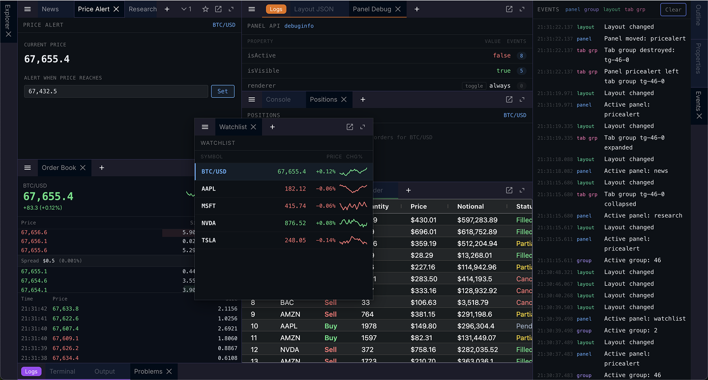

<div align="center">
<h1>dockview</h1>

<p>Zero dependency layout manager supporting tabs, groups, grids and splitviews. Supports React, Vue, Angular and Vanilla TypeScript</p>

</div>

---

[](https://www.npmjs.com/package/dockview)
[](https://www.npmjs.com/package/dockview)
[](https://github.com/mathuo/dockview/actions?query=workflow%3ACI)
[](https://sonarcloud.io/summary/overall?id=mathuo_dockview)
[](https://sonarcloud.io/summary/overall?id=mathuo_dockview)
[](https://bundlephobia.com/result?p=dockview)

##



Please see the website: https://dockview.dev

## Features

-   Serialization / deserialization with full layout management
-   Support for split-views, grid-views and 'dockable' views
-   Themeable and customizable
-   Tab and Group docking / Drag n' Drop
-   Touch & mobile support
-   Popout Windows
-   Floating Groups
-   Extensive API
-   Supports Shadow DOMs
-   High test coverage
-   Documentation website with live examples
-   Transparent builds and Code Analysis
-   Security at mind - verified publishing and builds through GitHub Actions

## Packages

| Package | Description | Version |
| --- | --- | --- |
| [`dockview`](https://www.npmjs.com/package/dockview) | Vanilla JavaScript / TypeScript — zero dependencies, full feature set out of the box | [](https://www.npmjs.com/package/dockview) |
| [`dockview-react`](https://www.npmjs.com/package/dockview-react) | React bindings (peer: `react` ≥16.8) | [](https://www.npmjs.com/package/dockview-react) |
| [`dockview-vue`](https://www.npmjs.com/package/dockview-vue) | Vue 3 bindings (peer: `vue` ≥3.4) | [](https://www.npmjs.com/package/dockview-vue) |
| [`dockview-angular`](https://www.npmjs.com/package/dockview-angular) | Angular bindings (peer: `@angular/core` ≥21) | [](https://www.npmjs.com/package/dockview-angular) |

## Installation

```bash
npm install dockview          # Vanilla JavaScript / TypeScript
npm install dockview-react    # React
npm install dockview-vue      # Vue
npm install dockview-angular  # Angular
```

## Quick Start (React)

```tsx
import { DockviewReact } from 'dockview-react';
import 'dockview-react/dist/styles/dockview.css';

const components = {
    default: (props) => <div>Hello {props.params.title}</div>,
};

function App() {
    const onReady = (event) => {
        event.api.addPanel({
            id: 'panel_1',
            component: 'default',
            params: { title: 'World' },
        });
    };

    return (
        <DockviewReact
            className="dockview-theme-dark"
            onReady={onReady}
            components={components}
        />
    );
}
```

For Vue and Angular examples see the [documentation](https://dockview.dev).

## Development

This project is an [NX](https://nx.dev) monorepo using [Yarn v1](https://classic.yarnpkg.com) workspaces.

```bash
yarn install    # Install dependencies
yarn build      # Build all packages
yarn test       # Run tests
yarn lint       # Run ESLint
yarn format     # Run Prettier
```

Build order is managed automatically by NX:

```
dockview-core → dockview → dockview-react
dockview-core → dockview → dockview-vue
dockview-core → dockview → dockview-angular
```

## Contributing

Contributions are welcome! Please open an [issue](https://github.com/mathuo/dockview/issues) or submit a pull request.

## License

MIT — see [LICENSE](./LICENSE) for details.

---

Want to verify our builds? Go [here](https://www.npmjs.com/package/dockview-react#user-content-provenance).
