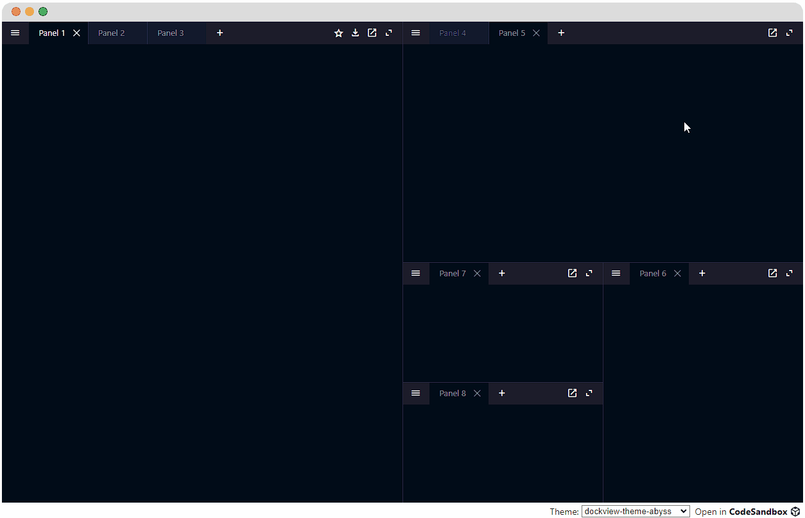

<div align="center">
<h1>dockview</h1>

<p>Zero dependency layout manager supporting tabs, grids and splitviews with ReactJS support written in TypeScript</p>

</div>

---

[](https://www.npmjs.com/package/dockview)
[](https://github.com/mathuo/dockview/actions?query=workflow%3ACI)
[](https://sonarcloud.io/summary/overall?id=mathuo_dockview)
[](https://sonarcloud.io/summary/overall?id=mathuo_dockview)
[](https://bundlephobia.com/result?p=dockview)

##



Please see the website: https://dockview.dev

## Features

-   Simple splitviews, nested splitviews (i.e. gridviews) supporting full layout managment with
    dockable and tabular views
-   Extensive API support at the component level and view level
-   Themable and customizable
-   Serialization / deserialization support
-   Tabular docking and Drag and Drop support
-   Floating groups, customized header bars and tab
-   Documentation and examples

Want to inspect the latest deployment? Go to https://unpkg.com/browse/dockview@latest/

## Quick start

Dockview has a peer dependency on `react >= 16.8.0` and `react-dom >= 16.8.0`. You can install dockview from [npm](https://www.npmjs.com/package/dockview).

```
npm install --save dockview
```

Within your project you must import or reference the stylesheet at `dockview/dist/styles/dockview.css` and attach a theme.

```css
@import '~dockview/dist/styles/dockview.css';
```

You should also attach a dockview theme to an element containing your components. For example:

```html
<body classname="dockview-theme-dark"></body>
```
