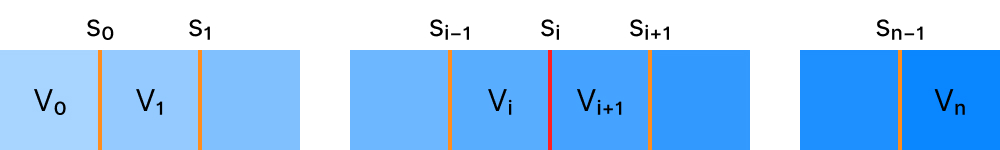
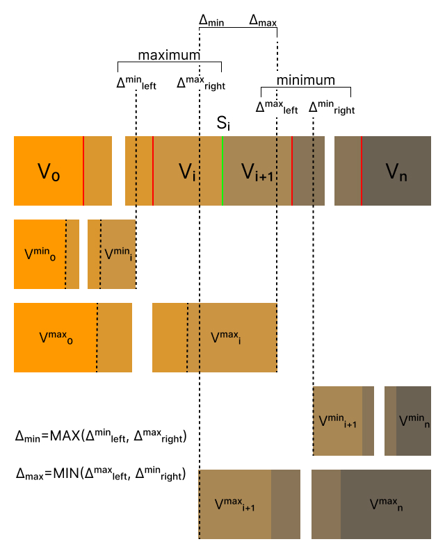

import { Splitview } from '../../src/components/splitview/math';

Wondering how to create a resizable split view, pane or window; whichever you may call it?
Here's a langauge indepedant walkthrough of how to design a split view control from scratch and the simple math behind it.
You will find links to all examples which are written using TypeScript.

Here's the end result and you can continue to read on to see how we got here.

<Splitview mode={3} debug={false} />

## First of all, what is a split view control?

Not all split view controls are born equal, but for our purposes

> A split view control is comprised from a number of 'views' layed out either horizontally or vertically.
> Each view can be indepedantly resized by dragging on the edge of a particular view.

In order to explain how this works we are going to need some more in-depth definitions so lets start with the two
fundamental components of this control, the <b>View</b> and the <b>Sash</b> (I will explain).
The below assumes the split view control has <b>n</b> views, where n is positive number.
For example if n=4 then our split view controls has 4 views. This generic approach will make it much easier to explain going forwards.

    
View

    <ul style={{ marginLeft: '40px' }}>
        <li>
            The size of the nth view will be known as Vn
        </li>
        <li>
            The minimum size of the nth view will be known as V
            min
            n
        </li>
        <li>
            The maximum size of the nth view will be known as V
            max
            n
        </li>
    </ul>

Additional by definition we can known Vminn <= Vn <= Vmaxn

To be able to resize a view we need to be able to drag on the edge of a view to increase or decrease it's size.
This can be achieved by introducing a narrow component that sits between each view acting as a 'drag handle'.
We will call this component a <b>Sash</b> because sash is also the word for those [windows](https://en.wikipedia.org/wiki/Sash_window) with movable panels.

  
Sash

  <ul style={{marginLeft: "40px"}}>
    <li>If we have n views then we will have n-1 sashes. There is no sash before V0 nor after Vn</li>
    <li>The sash between Vn and Vn+1 is known as Sn</li>
    <li>The sash is of fixed width, and it's sole purpose is to act a drag-handle for resizing views</li>

  </ul>

This now gives us a definition of the split view control but in additional to that, to calculate the new view sizes
after a sash is dragged we need to know which sash is being dragged.
We will denote the sash Si as the sash to drag going forwards we can reference the following diagram.

If we are to drag the sash Si then we need to also know how far along the x-axis, or the horizontal-axis we have travelled.
We can denote this as the delta, using the symbol Δ.
Delta is only limited by how wide the screen is so for this purpose we can say it ranges from negative to positive infinity, that is -∞ < Δ < ∞ .

In reality as you will see we will apply a set of constraints on the value of Δ reducing it's overall set of valid values.

## Iteration #1 - The naive approach (aka. the accordian)

As I add delta I increase view sizes and as I remove delta I decrease view sizes.
A rather naive approach but it could look something like this:

-   as the sash moves left shrink each view to the left and as the sash moves right expand each view to left, from right-most to left-most in both caes.
-   If there is enough delta to shrink a view to it's mimimum size then move onto the next view, and if we have enough delta to expand a view to it's maximum size then again move onto the next view.
-   Shrink no more once everything to the left is at minimums and expand no more once everything to the left is at maximums
-   We don't manipulate any views to the right of the active sash Si

You should be able to show each of the four points above hold true for the below interactive example.
You'll see that changes to the right will always remain at zero because we are not manipulating views to the right of the active sash.

<Splitview mode={1} debug={true} />

There are some obvious flaws with this approach but before we go into that lets put this implemenation in psuedocode using our definitions
from above where we drag sash Si by an amount Δ

    

        Δremaining = Δ
    

    

        for
        
            (j = i; j >= 0; i--)
        
         do
    

    

        
            Vnext
            j = Min(V
                max
            
            j, Max(V
            min
            j, Vj + Δremaining))
        
    

    

        
            VΔ
            j = Vnext
            j - Vj
        
    

    

        
            Δremaining = Δremaining - VΔ
            j
        
    

    

        
            Vj = Vnext
            j
        
    

or in plain text

    

        
1

        
2

        
3

        
4

    

    

        

            For each view j to the left of the sash we have dragged, from
            right-most to left-most
        

        

            Add the delta to the view j (clamped at either the maximum or
            minimum value)
        

        

            Subtract the different between the new and old size (the used delta)
            from the remaining delta
        

        
repeat

    

Going back to that obvious flaw, the width of the control does not remain constant. It flexes with Δ.

## Iteration #2 - Δ is added. Then Δ must be removed

We want a component of constant width and we dont want to think too hard.
So If I have added Δ to the left then I should add -Δ (or remove Δ) on the right, and vice-versa; right? Nearly.

<Splitview mode={2} debug={true} />

There are some more subtle flaws with this approach; but lets describe it in psuedocode first.
We now need another variable to track the delta we've added on the left, Δused.
After we've applied changes to the left side we'll substract this Δused from the right side which should keep the width of our control at a
constant size.

    

        Δremaining = Δ
    

     

        Δused = 0
    

     

      for(j = i; j >= 0; i--)
       do
    

    

      
          Vnextj = Min(Vmaxj, Max(Vminj, Vj + Δremaining))
      
    

     

      
            VΔj = Vnextj - Vj
      
    

    

      
      Δremaining = Δremaining - VΔj
      
    

    

      
      Δused = Δused + VΔj
      
    

    

      
        Vj = Vnextj
      
    

for({"j = i+1; j < n; i++"})
 do

    Vnextj = Min(Vmaxj, Max(Vminj,Vj - Δused))

    VΔj = Vnextj - Vj

Δused = Δused + VΔj

Vj = Vnextj

Go back and try to minimise or maximise every view in the container. The width is no longer preserved, you can see at some point the change to the left
is not longer eqaul to the change on the right, which causes the container to once again flex.

## Iteration #3 - Constraining the values of Δ

In the cases where iteration #2 is not working correctly this can be explained as either adding or removing too much delta.
Fortunately it turns out there are a few constraints we can define on delta to help with this.
For a sash Si lets think about the minimum and maximum amount of delta we can use.
Try to follow the explainations first and then we will use another interactive example and diagram to reinforce the explaination.

> Si can go no further left that the sum of the minimum sizes of the views to the left, and can go no further right than the sum of the
> minimum sizes of the views to the right; because otherwise you would end up with at least one view that is smaller than it's specified minimum.

> Another less obvious condition on Si is that it can go no further left that the sum of the maximum sizes of the views to the right, and can go no further
> right than the sum of maximum sizes to the left; because otherwise you would end up with at least one view that is larger than it's specified maximum.

This leaves us with 4 constraints we need to apply on Δ; but since Δ is relative to Si first of all we need these
constraints relative to Si. That is to say what amount of Δ is equivalent to the constraints we just described.

When the views to the left of Si are all at minimum size we will call the distance between here and Δ to be Δminleft.
This distance would be the sum of the differences between
Vminj and Vj for each view, or in more format notation we could write this as

    
        Δmin
        left = Σ Vmin
        j - Vj
    
    j = i,...0

Similarly we can work out the distance between Si and the point at each every view to the left is at its
maximum size as the sum of differences between Vmaxj an Vj

    
        Δmax
        left = Σ Vmax
        j - Vj
    
    j = i,...0

The same logic can be applied to work out those values for Δminright and Δmaxright

    

        
            Δmin
            right = Σ Vj - Vmin
            j
        
        j = i+1...n
    

    

        
            Δmax
            right = Σ Vj - Vmin
            j
        
        j = i+1...n
    

We now have two minimum constraints which are Vminleft and Vmaxright and two maximum
constraints Vmaxleft and Vminright.
To get one minimum and maximum value for the Δ we should take the maximum of the two minimums and the minimum of the two maximums which will
ensure all four constraints will hold true.

    

        Δmin = MAX ( Vmin
        left , Vmax
        right )
    

    

        Δmax = MIN ( Vmax
        left , Vmin
        right )
    

Finally we must clamp our Δ to be within this minimum and maxium boundary.
This clamped delta can be used in place of delta in the pseudocode from iteration #2.

    Δclamped = MIN ( Vmax , MAX ( Vmin , Δ ) )

You can see how this works in this interactive example which also shows the current values of our four constraints for each sash drag event.

<Splitview mode={3} debug={true} />

Additionally you can see in the below diagram how all of our above calculations come together to give a minimum and maximum constraints on Δ.

## Appendix

### The clamp function

To clamp a value is to say given a value, a minimum and a maximum return

-   the minimum, if value < minimum
-   the maximum if value > maximum
-   otherwise returning the value

In otherwords we have 'clamped' the value to be within our defined minimum and maximum values. Mathematically we can write this as

    <b>f</b>(value, valuemin, valuemax) = <b>MIN</b>(value
    max, <b>MAX</b>(valuemin, value))

with some examples

    

        <b>f</b>(10, 20, 30) = 20
    

    

        <b>f</b>(40, 20, 30) = 30
    

    

        <b>f</b>(25, 20, 30) = 25
    

